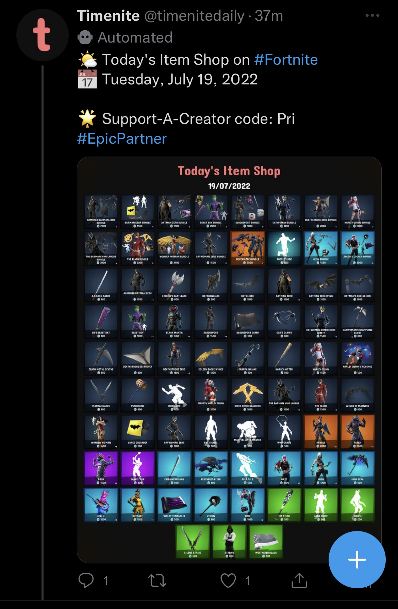

&nbsp;

Introducing, Timenite Daily

Gone are the days when Timenite.com was just a simple website that showed countdowns. 

&nbsp;

Let's keep it short. From now onwards, we're introducing a new service called Timenite Daily
which is going to fetch Fortnite Item Shop's data every day at 00:00 (the moment it resets)
and construct and post images on Timenite's new social media (@timenitedaily), 3 minutes after the official reset.

&nbsp;

For now, the automated posts are live and will be updated every day on both our <a href="https://twitter.com/timenitedaily" target="_blank">Twitter</a> and <a href="https://instagram.com/timenitedaily" target="_blank">Instagram</a>. But if you're not a social media person, we're also bringing it to the <a href="https://timenite.com/item-shop">Item Shop</a> page (to be improved soon).

&nbsp;

&nbsp;

As of now, you may see duplicate or untimely posts on the socials but it was all done while testing so do not worry. 

&nbsp;

Huge shoutout to <a href="https://fortnite-api.com" target="_blank">Fortnite-API</a> for being such an amazing public and free-to-use API which is what we're using to make Timenite Daily possible. 

&nbsp;

We hope that this is helpful for the community.